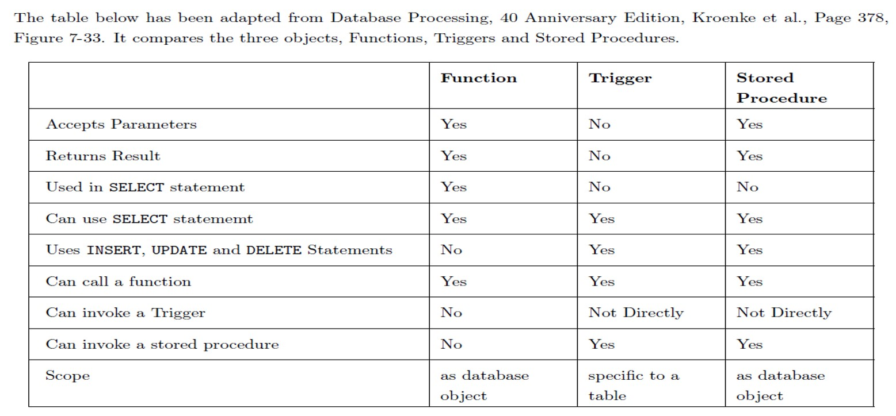
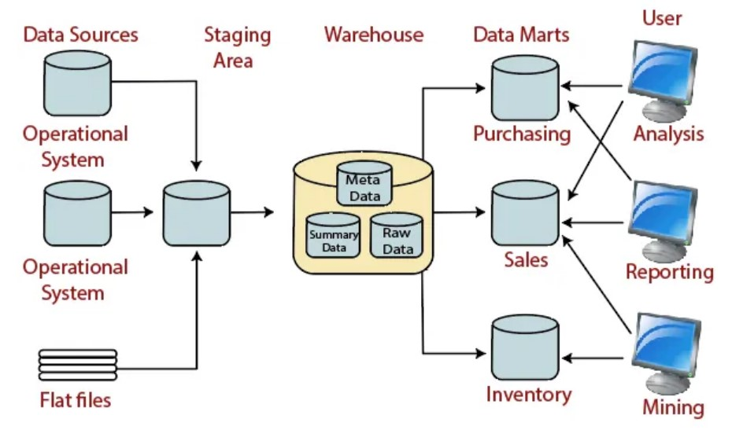
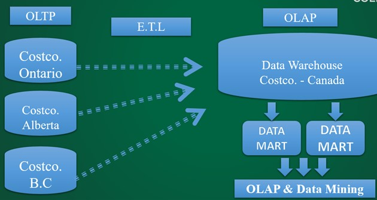

# Database System - PostgreSQL and Oracle
- [Database System - PostgreSQL and Oracle](#database-system---postgresql-and-oracle)
  - [WEEK 9 PostgreSQL](#week-9-postgresql)
    - [9.1. PostgreSQL Characteristics](#91-postgresql-characteristics)
    - [9.2. PostgreSQL database programming](#92-postgresql-database-programming)
    - [9.3. Advantages of PL/pgSQL](#93-advantages-of-plpgsql)
    - [9.4. PL/pgSQL object: Functions](#94-plpgsql-object-functions)
    - [9.5. PL/pgSQL object: Procedures](#95-plpgsql-object-procedures)
    - [9.6. PL/pgSQL object: Trigger](#96-plpgsql-object-trigger)
    - [9.7. PostgreSQL - Storage Hierarchy](#97-postgresql---storage-hierarchy)
  - [WEEK 10](#week-10)
    - [10.1. Oracle Introduction](#101-oracle-introduction)
    - [10.2. Basic Tools and Processes](#102-basic-tools-and-processes)
    - [10.3. Oracle Users](#103-oracle-users)
    - [10.4. Oracle Privileges and Roles](#104-oracle-privileges-and-roles)
    - [10.6. Code example: Users, Privileges, and Roles](#106-code-example-users-privileges-and-roles)
    - [10.7. Advance SQL: Case Structures](#107-advance-sql-case-structures)
    - [10.8. Physical and Logical Database Objects](#108-physical-and-logical-database-objects)
    - [10.9. Oracle Database Objects - Index](#109-oracle-database-objects---index)
    - [10.10. Oracle Database Objects - Sequence](#1010-oracle-database-objects---sequence)
    - [10.11. Oracle Database Objects - Synonyms](#1011-oracle-database-objects---synonyms)
  - [WEEK 11](#week-11)
    - [11.1. PL/SQL Introduction](#111-plsql-introduction)
    - [11.2. Oracle PL/SQL of Features](#112-oracle-plsql-of-features)
    - [11.3. Use of SQL in PL/SQL](#113-use-of-sql-in-plsql)
    - [11.4. Data Types in PL/SQL](#114-data-types-in-plsql)
    - [11.5. Anonymous PL/SQL Block Syntax](#115-anonymous-plsql-block-syntax)
    - [11.6. Named PL/SQL Block: Procedures](#116-named-plsql-block-procedures)
    - [11.7. Named PL/SQL Block: Functions](#117-named-plsql-block-functions)
    - [11.8. Data Dictionary Views](#118-data-dictionary-views)
  - [WEEK 12](#week-12)
    - [12.1. Database Trigger](#121-database-trigger)
    - [12.2. Instead Of Trigger](#122-instead-of-trigger)
    - [12.3. PL/SQL Packages](#123-plsql-packages)
    - [12.4. Data Warehousing, OLTP, OLAP, and Data Minining](#124-data-warehousing-oltp-olap-and-data-minining)
  - [WEEK 13](#week-13)
    - [13.1. Oracel - Indexes](#131-oracel---indexes)
    - [13.2. Oracle - XML](#132-oracle---xml)
    - [13.3. Oracle - JSON](#133-oracle---json)
    - [13.4. Oracle - ODBC](#134-oracle---odbc)
  - [APPENDIX A: MySQL](#appendix-a-mysql)
    - [MySQL Introduction](#mysql-introduction)
    - [MySQL Officially](#mysql-officially)
    - [MySQL Workbench – Introduction](#mysql-workbench--introduction)
    - [MySQL Architecture (Queries)](#mysql-architecture-queries)
  - [APPENDIX B: Others](#appendix-b-others)
    - [SQL is divided into 4 sub languages:](#sql-is-divided-into-4-sub-languages)
    - [DBMS GUI](#dbms-gui)
    - [Several languages to write trigger](#several-languages-to-write-trigger)
    - [trigger support of different DBMS](#trigger-support-of-different-dbms)
    - [Materialized View and Oracle Database](#materialized-view-and-oracle-database)

## WEEK 9 PostgreSQL

### 9.1. PostgreSQL Characteristics
- PostgreSQL is an object-relational database management system (ORDBMS) developed at Berkeley Computer Science Department, University of California.
- PostgreSQL is an "truly" open-source RDBMS as it is managed by The PostgreSQL Global Development Group. It is licensed using The PostgreSQL License, a license recognized by the **Open Source Initiative**. PostgreSQL is developed and managed without a corporate owner or a commercial counterpart.
- PostgreSQL can be used, modified, and distributed by anyone __free__ of charge for any purpose, be it private, commercial, or academic.
- MySQL does not support materialized views, PostGreSQL does support
- PostgreSQL supports SQL & PL/pgSQL i.e. programming extension.

### 9.2. PostgreSQL database programming
- PostGreSQL offers several languages to program with including: PL/pgSQL, PL/Tcl, PL/Perl, PL/Python
- PL/pgSQL is a _loadable procedural language_ for the PostgreSQL databases.
- The Three programmable object of PL/pgSQL are: Procedures, Functions, Triggers
  
### 9.3. Advantages of PL/pgSQL
> The design goals of PL/pgSQL were to create a loadable procedural language that:
- Adds _Conditional Statements & Loops_ to the SQL language (SQL is not procedural programming language)
- Can be used to create *procedures, functions and *triggers\*
- Allows _reusability_ of code by storing procedures, functions and triggers code within the database in compiled form
- Compiled code offer better _performance_
- Can perform complex computations
- is easy to use.
> programmability, reusability, performance

### 9.4. PL/pgSQL object: Functions
- Functions are ideal for performing calculations and must return a single value. 
- Functions can be executed independently or in part of SELECT statement
- Embed function in SELECT statement may cause error, it's important to carefully check the syntax and input values when using functions in a SELECT statement to avoid potential errors. _table mutating error_

```sql
/* Create a user defined function that accepts and adds two values */
CREATE OR REPLACE FUNCTION add( a FLOAT, b FLOAT) RETURNS FLOAT
AS
$$ BEGIN --(1)
     RETURN( a + b );
     END;$$
LANGUAGE 'plpgsql'; --(2)

/* To Test the Function */
SELECT add( 7, 5 );

/* List all emps with their salary and 500 bonus added to salary. Note: The below queries requires a table named emp with the listed columns. */
SELECT ename, sal, comm, add(sal,500) "Bonus" FROM emp;

-- (1) $$ is pl/pgsql specific
-- (2) LANGUAGE 'plpgsql'; is also pl/pgsql specific
```

### 9.5. PL/pgSQL object: Procedures
- Procedures are ideal for performing SELECT or DML. 
- Procedures generally do not return a value
- cannot be called in SELECT statement

```sql
/* Sample PROCEDURE code – Needs a table named dept with columns deptno, dname & loc */
CREATE OR REPLACE procedure add_dept (deptno int, dname VARCHAR, loc VARCHAR)
AS
$$ BEGIN
	INSERT INTO dept VALUES (deptno, dname, loc);
END;$$
LANGUAGE 'plpgsql’;
```

### 9.6. PL/pgSQL object: Trigger
- Triggers are block of code that executes automatically based on an event in the database such as a insert, update or delete on a table.
- A __trigger function__ is a special user-defined function associated with a table. To create a new trigger, you define a trigger function first, and then bind this trigger function to a table. 
- A trigger function has access to data values before and after the data change event. These data values are used as `NEW.<columnname>` and `OLD.<columnname>`. OLD and NEW can be compared to determine if a change has taken place.
- Trigger VS procedure and function: a trigger is automatically invoked when a triggering event occurs and PL/pgSQL trigger has two-step operations. See summary of difference in the table below.

- PostGreSQL has both regular triggers and event level triggers.
  - Regular Triggers are attached to a single table and capture only DML events
  - Event Triggers are global to a particular database and are capable of capturing DDL events
- PostGreSQL Triggers are 2 part items:
  - Part 1 – the function. The function MUST return a TRIGGER type
  - Part 2 – the actual trigger that calls the function


```sql
-- create a trigger to log last name change 

-- 1. create a trigger function 
CREATE OR REPLACE FUNCTION Log_Last_Name_Change() 
RETURNS TRIGGER  -- the function must return a TRIGGER type
AS
$$ BEGIN
    -- check if last_name has changed
    -- compare NEW. to OLD.
    IF NEW.last_name <> OLD.last_name THEN
      INSERT INTO Employee_Audit_T( Employee_ID, Old_Last_Name, changed_ON ) VALUES( OLD.Employee_ID, OLD.Last_Name, NOW() );
    END IF;
    RETURN NEW;
END;$$
LANGUAGE plpgSQL;

-- 2. associate the above trigger function with the trigger.
CREATE TRIGGER Emp_Last_Name_Change
   BEFORE -- trigger time
   UPDATE ON Employee_T -- trigger event
   FOR EACH ROW -- trigger type
   EXECUTE PROCEDURE Log_Last_Name_Change();-- trigger action 
```



### 9.7. PostgreSQL - Storage Hierarchy
- A PostgreSQL __server__ is the top of the hierarchy. When you install postgresql, you are actually installing a server. A Server can host one or more databases.
- A __tablespace__ is a location on the disk where PostgreSQL stores data files containing database objects. PostgreSQL comes with two default tablespaces: pg_defaulttablespace stores _user data_ and pg_globaltablespace stores _global data_. Tables, indexes, and entire databases can be assigned to particular tablespaces.
- A __Database__ is a named collection of "Database Objects" like tables, views, procedures, triggers, etc.
- A __Schemas__ in database are used to organize database into logical groups to make them more manageable. Schema is a just a namespace to logically group objects. PostgreSQL has one default schema named "Public" and more schemas can be created as needed. 
- Summary
  - Schemas are _logical_ and Tablespaces are _physical_ location on PC disk.
  - One server can have one or more tablespaces. Default is two(default, global) 
  - One tablespace can have one or more databases.
  - Each database can have multiple schemas (no physical meaning, just a logical container/group), default is public
  - each user can have their own default tablespace. 

## WEEK 10

### 10.1. Oracle Introduction
- Oracle has MANY features, add-ons, third-party modelling tools, import/export products, …
- Market dominance in Online Transaction Processing (OLTP)
- Focus of development stream is cloud and 24x7 availability
- Oracle Database has a feature called Result Cache, which allows the database to share and reuse result sets in memory. 
  
### 10.2. Basic Tools and Processes
- Command-line administration tool: sqlplus**
  - Usage: `sqlplus username/password [as rolename]`
  - E.g., `sqlplus sys as sysdba` Which will then prompt for a password
- GUI tool: Oracle SQL Developer
  - Equivalent to MySQL Wokbench and SQL Server Studio
  - Administrative Tasks
    - Backup, restore, etc
    - Create users   
    - Run ANY SQL
  -	Modelling environment using E-R diagrams to manage application schemas
- DB Tool: Enterprise Manager
  - Web-based administration tool with server that can manage remote database instances; including replication, storage, etc.
  - Provides usage data in graphical format
  - Currently shipped as Flash application in 12c. ; 19c requires dedicated server installation and management
- RMAN
  - "Recovery Manager"
  - Manages backups (incremental/full) and can recover to a point in time.
- MANY other tools available from ORACLE and third-parties, such Oracle GoldenGate

### 10.3. Oracle Users
- When you Install Oracle RDBMS and Create a Database, certain users are automatically added.
- __SYS__ is the top level _admin_ user of oracle database. Login to SYS must follow the keyword 'SYS AS SYSDBA'.
- __SYSTEM__ is another _admin_ user of oracle database.
- __SCOTT__, __HR__, etc. are other popular oracle users with *developer* level permissions that are also created in Oracle.
> SYS can create multiple DBA; DBA is 24*7 job and commonly have multiple DBA work on shifts.

### 10.4. Oracle Privileges and Roles
- A user privilege is a right to execute a particular type of SQL statement, or a right to access another user's object.
- Privileges are sub-divided into:
  - System Privileges 
    - Can be granted ONLY by the *DBA* (i.e. SYS user)
    - allows a user to connect to database and create their own objects i.e. table, view, etc. 
      - CREATE SESSION
      - CREATE TABLE (Includes Create Index)
      - CREATE VIEW
      - CREATE PROCEDURE (Includes Create functions) 
  - Object Privileges 
    - Can be granted by *Owner of the object* or *DBA*.
    - allows a user to access other users objects.      
      - INSERT
      - UPDATE
      - DELETE
      - EXECUTE (for functions/procedures)
- Data Control Language (DCL) - GRANT, REVOKE. DCL Statements are used to grant and revoke privileges in oracle database. 
> You don't need object privilege on the objects created by you. As the owner of the object, you have all privileges on that object.

- A Role is a group of privileges.
- built-in roles (Role Eg: Connect, Resource, DBA, etc.)
- you can create user-defined & customized roles.
- __role nesting__: you can assign a role to another role. 
> A new user, if granted with CONNECT & RESOURCE roles, will have almost all the privileges that a database developer would need.

### 10.6. Code example: Users, Privileges, and Roles
```sql
/* example: Create a user, connect as a user, and grant roles to a user */

-- good practice to have a clean look in sqlplus
col name format a30
col type format a30
set linesize 120

-- must login as sys:
connect sys as sysdba;

-- create a user
CREATE USER worldShortestMan 
IDENTIFIED BY buyhimacoffee  -- set the password
QUOTA unlimited ON USERS; 

-- check users
select username from dba_users;

-- connect as user "worldShortestMan" with password "buyhimacoffee"
connect worldShortestMan/buyhimacoffee;

-- grant previleges 
GRANT connect, resource TO worldShortestMan;
-- revoke previleges 
REVOKE connect, resource TO worldShortestMan;
```

### 10.7. Advance SQL: Case Structures
- Oracle CASE expression allows you to add if-else logic to SQL statements __without having to call a procedure__. 
- No if else in SQL, use CASE instead
- The CASE expression evaluates a list of conditions and returns one of the multiple possible results.

```sql
-- Case Structures used to implement If-Then-Else Logic in Select 
SQL> 
SELECT ename, empno, sal,
  (CASE
     WHEN sal < 1000 THEN 'Low'
     WHEN sal BETWEEN 1000 AND 3000 THEN 'Medium'
     WHEN sal > 3000 THEN 'High'
     ELSE 'N/A'
  END) salary
FROM emp
ORDER BY ename;
-- To edit SQL statements in Notepad: type “ed” in CMD will display the last statement you input in a Notepad -> Save -> Exit
-- after paste the code block to cmd, type "/" and enter to run the statement
```

### 10.8. Physical and Logical Database Objects
- Physical Database Objects – Objects that occupy disk space and grow in size. 
  - Table 
  - Index
  - Materialized View
- Logical Database Objects – Object that remain _static_ their size i.e. do no grow in size or demand disk space in future. 
  - View
  - Sequence 
  - Synonyms 
  - Procedure
  - Function
  - Triggers

### 10.9. Oracle Database Objects - Index
- Indexes are _physical_ database objects created on a table's column to optimize the retrieval process i.e. Speed up the `SELECT` statements. (A full table scan without using index will slow down the process)
- Index are __automatically__ created for every *primary key & unique key* columned constraint.
- Index may be manually created using the `CREATE INDEX…` statement.
  - `CREATE INDEX indexName ON tableName(columnName)`
- Index optimize SELECT but they may slow down DML due to the over-head of maintaining the index segments. Hence, unnecessary indexes should be avoided.

> In situations with many updates (INSERT, UPDATE, DELETE) and few read accesses, indexes can negatively affect performance. This is because, for every update, the database needs to maintain and update the indexes, which can consume additional system resources and time. In such cases, it is important to carefully consider the choice and design of indexes to balance the trade-off between read and write performance.
>
> Best practice: don’t create index manually, use automatically created index (i.e. PK etc.).


```sql
/** INDEXES **/

-- format the column header as left-aligned with a width of 30 characters. 
col table_name format a30
col index_name format a30

/* Accessing the data dictionary of Indexes. user_indexes is built-in table in Oracle database */
select table_name, index_name from user_indexes;

/* Creating an Index on emp table's deptno column */
CREATE INDEX deptno_indx ON emp(deptno);
select table_name, index_name from user_indexes;

-- drop index
DROP INDEX deptno_indx;
```

### 10.10. Oracle Database Objects - Sequence
- Sequences are _logical_ database objects that are used to generate sequential numbers.
- The numbers generated by sequence are generally used as _primary key values_ in a table.
- Sequences are NOT linked to a particular table but general practice is to create a dedicated sequence for a table's column.
- Sequences uses pseudo columns like `<sequencename>.currval` and `<sequencename>.nextval` to return values.
> An independent value, it’s user’s choice on how to use it

```sql
-- SEQUENCES 
CREATE SEQUENCE dno_seq
START WITH 60
INCREMENT BY 10;

SELECT * FROM user_sequences;

/* Calling values from sequences using NEXTVAL and CURRVAL */ 
SELECT dno_seq.currval from dual;
-- ERROR at line 1: ORA-08002: sequence DNO_SEQ.CURRVAL is not yet defined in this session 

SELECT dno_seq.nextval from dual;

-- check the dept table
SELECT * from dept;

/* Inserting records in dept table using dno_seq */
INSERT INTO dept VALUES (dno_seq.nextval, 'IT','KANATA');
INSERT INTO dept VALUES (dno_seq.nextval, 'Finance','TORONTO');
INSERT INTO dept VALUES (dno_seq.nextval, 'Legal','Ottawa');
INSERT INTO dept VALUES (dno_seq.nextval, 'HR','TORONTO');
-- no error! so far so good

INSERT INTO dept VALUES (dno_seq.nextval, 'Marketing','LONDON')
-- ERROR at line 1:
-- ORA-01438: value larger than specified precision allowed for this column 
/* Note: this error is because the deptno datatype is NUMBER(2) so it cannot store the next sequence value i.e. 100 */

-- check the table and see the sequence column
SELECT * from dept;
```

### 10.11. Oracle Database Objects - Synonyms

- Synonyms are logical database objects that serve as a permanent alternate name for tables and/or views.
- Generally used to make complex table/view names shorter and easier.
- Synonyms do not replace original table/view name, just add an alter name for the same table/view.
- The table/view can be accessed using original name as well as synonym.
- Alias is temporary, Synonyms is permanent.
```sql
-- Need CREATE SYNONYM privilege 
GRANT CREATE SYNONYM TO username;
CREATE SYNONYM d FOR dept;
DROP SYNONYM d;
```

## WEEK 11

### 11.1. PL/SQL Introduction
- PL/SQL includes procedural language elements such as conditions and loops. It allows declaration of constants and variables, procedures and functions, types and variables of those types, and triggers. 
- It can handle exceptions (run-time errors). Arrays are supported involving the use of PL/SQL collections. 
- Implementations from version 8 of Oracle Database onwards have included features associated with object-orientation. One can create PL/SQL units such as procedures, functions, packages, types, and triggers, which are stored in the database for reuse by applications that use any of the Oracle Database programmatic interfaces.
- Oracle gets high-performance through sharing memory across connections and across queries

### 11.2. Oracle PL/SQL of Features
- PL/SQL is a Database Language restricted only to do the database programming.
- PL/SQL Can Have Any Number of Statements, Which Reduces the Network Traffic.
- PL/SQL Program can reside either at the front end or within Oracle Database Server as Stored Subprogram.
- PL/SQL programming blocks can be Anonymous Blocks or Named Sub Programs.
- Named PL/SQL Sub-Programs that can be stored within the database are: Procedures, Functions, Triggers and Packages.
- These Stored Sub Programs allows reusability of Code, Better Performance & Programmability.

### 11.3. Use of SQL in PL/SQL
- PL/SQL is tightly integrated with SQL. 
- _Valid_ SQL Statements in PL/SQL
  - All DML Statements (Insert, Update, Delete)
  - All TCL (Commit, Rollback)
  - All SQL Functions (Single & Group function)
  - All SQL Predicates (Where, Having, Group By, Order by)
- _Invalid_ SQL Statements in PL/SQL Are:
  - DDL Statements (Create, Alter, Etc)
  - DCL Statements (Grant, Revoke)
  - PL/SQL may not directly make use of these statements. However, there is work around logics for it.

### 11.4. Data Types in PL/SQL
- PL/SQL Data Types are primarily divided into two categories. **Scalar Data Types** and **Composite Data Types.**
  - Scalar data types can hold a single value per variable. Composite data types have internal components and it may hold multiple values per variable.

> %TYPE Attribute can be used to declare a variable as per the data type of an underling table/view's column.

- Scalar Data Types
  - Char [Max Length]
  - Varchar2 [Max Length]
  - Long
  - Date
  - Number [Precision, Scale]
  - Binary_Integer
  - Boolean
- Composite Data Types
  - Records (row type)
  - Index By Table (column type)
  - Index By Table of Records (2-dimensional)
  - %RowType
```sql   
/* Several basic PL/SQL examples are posted below. Using SCOTT user, Copy paste them one by one and analyze their execution. If using SQL* Plus (command), then first issue the command 'SET SERVEROUT ON' */

/* Examples: Simple Data Type Demo */ 
Declare
  v_name      Char(20); 
  v_course    Varchar2(20); 
  v_duration  Number(3):= 30;
Begin
  v_name :='TOM';
  v_course := 'Oracle';
  dbms_output.put_line(v_name);
  dbms_output.put_line(v_course);
  dbms_output.put_line(v_duration);  
End;
/* ----------------------------------------------------------- */
/* Example: Using %TYPE Attribute */
DECLARE
  v_name      emp.ename%type;
  v_job       emp.job%type;
  v_sal       emp.sal%type;
BEGIN
  select ename,job,sal
  into   v_name, v_job, v_sal
  from emp
  where empno =7902;
  dbms_output.put_line(v_name||' '||v_job||' ' ||v_sal);
END;
/* ----------------------------------------------------------- */
/* using & for user input    */
/* Example: EXAMPLE: IF Demo to Find the Greater of two numbers */
DECLARE
  a number(2) :=&value_of_a;
  b number(2) :=&value_of_b;
BEGIN
  if a>b then
    dbms_output.put_line(a ||' is Greater');
  elsif a<b then   
    dbms_output.put_line(b ||' is Greater');
  else
    dbms_output.put_line(' Both are equal ');
  end if;
END;

/* ----------------------------------------------------------- */
/* Example: SIMPLE LOOP Demo To Display 1 to 10 */
DECLARE
	i NUMBER(2) := 1;
BEGIN
	LOOP
		dbms_output.put_line(i);
		EXIT WHEN i >= 10;
		i := i+1;
	END LOOP;
END;

/* ----------------------------------------------------------- */
/* Example: WHILE LOOP Demo To Display 1 to 10 */
DECLARE
  a number := 1;
BEGIN
  while a<=10
  LOOP
    dbms_output.put_line(a);
    a:= a + 1;
  END LOOP;
END;

/* ----------------------------------------------------------- */
/* Example:  FOR DEMO to Display 1 to 10 */
BEGIN
  FOR i in 1..10 
  LOOP
    dbms_output.put_line(i);
  END LOOP;
END;

/* ----------------------------------------------------------- */
/* Example: Creating a Record Data Type on Emp’s Table Using %ROWTYPE Attribute */
DECLARE
  e EMP%ROWTYPE;
BEGIN
  select * into e from emp where empno=&Emp_No;      
  dbms_output.put_line(e.empno||' '||e.ename||' '||e.sal||' '||e.hiredate);
END;


-- Assign value to a variable using  ":=" 
-- check if two variables are equal using  "="  
```
### 11.5. Anonymous PL/SQL Block Syntax

```sql
-- Anonymous PL/SQL Block Syntax
Declare (Optional)
	Variables, Cursors and User defined Exception.
Begin   (Mandatory)
	Program Logic / Executable Statements
Exception (Optional)
	Exception Handling Code
End;
```

### 11.6. Named PL/SQL Block: Procedures
- A Procedure is a named PL/SQL Block, stored in the database and it is generally used to perform an action, such as a DML into a table or a SELECT from a table.
- May not return a value.
- When a procedure is first created, it is compiled and stored within the database in compiled form.
- This compiled code allows reusability and performance benefits.
- Parameter can have three modes in a procedure
  - IN(default)
  - OUT
  - INOUT mode.
```sql
/* EXAMPLE: Procedure To Add A Records in Dept’s Table. */
CREATE OR REPLACE PROCEDURE add_dept
  (p_dno in number,
  p_name in varchar2,
  p_loc  in varchar2)
AS
BEGIN
  insert into dept values(p_dno, p_name, p_loc);
END;

/* The Above procedure, when created will accept 3 parameters and insert it into dept’s table. To Execute this procedure from SQL* PLUS Tool */

Desc add_dept
EXEC add_dept(50, 'IT', 'KANATA');
Select * from dept;

/* EXAMPLE: Procedure to Fetch a Record from Table. */
CREATE OR REPLACE PROCEDURE get_emp
  (p_eno in number,
  p_name out varchar2,
  p_job out varchar2,
  p_sal out number)
IS
BEGIN
  select ename, job, sal  into p_name,p_job, p_sal from emp
  where empno = p_eno;
END;

/* The Above procedure accepts a empno and returns the name, job and salary of the given employee.  This procedure, when executed will need three variables to hold the three values returned by the procedure. To Execute this procedure from SQLPLUS. */
Desc Get_Emp
VARIABLE n VARCHAR2(20)
VARIABLE j VARCHAR2(20)
VARIABLE s NUMBER
EXEC Get_Emp(7788, :n, :j, :s)
PRINT 
/* Note: In real time, a procedure will generally be invoked from a front-end programmed in Java, .Net, etc */
```

### 11.7. Named PL/SQL Block: Functions
- Function is a named PL/SQL Block, 
- MUST return a single value. (Should not be used for DML(Insert, Update, Delete))
- A function may be called as part of an expression.

> Functions and Procedures are structured alike.
> 
> Oracle Recommends using a procedure for performing SELECT or DML and Functions for calculations.

- Location to call User-Defined Function:
  - Select Command.
  - Where, Group by, Having & Order by Clauses.
  - In an Insert Statement.
  - In Update Statement.

```sql
/* EXAMPLE: Function To Calculate The Experience of a given employee */
CREATE OR REPLACE FUNCTION emp_exp(p_eno NUMBER) RETURN NUMBER
AS
  hdate date;
  e number;
BEGIN
  select hiredate into hdate  from emp  where empno = p_eno;
  e :=  round(months_between(sysdate, hdate) / 12);
  return e;
END;

Desc Emp_Exp

-- To Execute - Method 1:
VARIABLE exp NUMBER
EXEC :exp := emp_exp(7902);
PRINT exp

/* To Execute - Method 2:  */
select emp_exp(7902) from dual;

/* To Execute - Method 3: call the method in a select statement*/
select ename, sal, hiredate, emp_exp(empno) from emp;

/* EXAMPLE: Function To Calculate Tax of a Given Employee */
CREATE OR REPLACE FUNCTION tax(p_sal number) RETURN NUMBER
AS
  v_tax number(8);    
  BEGIN
    if p_sal between 0 and 2000 then
       	 v_tax := p_sal * 0.10;
     elsif p_sal between 2001 and 4000 then
        v_tax := p_sal *0.20;
    else 
        v_tax := p_sal * 0.30;
    end if;
    return v_tax;
END;

Desc tax
select ename, sal, tax(empno) from emp;
```

### 11.8. Data Dictionary Views
- The information of procedures, functions and packages can be obtained from the following data dictionary view. Note that the user_procedures and user_source are common DDV for procedures, functions and packages. There are no separate DDV for functions and packages.

```sql
select Object_Name, Procedure_Name From User_Procedures;
Select Name, Text From User_Source Where name = 'TAX' Order By Name, Line
```

## WEEK 12
### 12.1. Database Trigger

- A Database Trigger
  - a PL/SQL Block which is associated with a table, view, schema or the entire database.
  - A Trigger is never called (i.e. Executed), It Executes Implicitly (Automatically) whenever a particular event takes place.
  - Hence, Triggers may be used to perform automated task based on certain events.
- Two types:

  1. Schema Level Trigger: Based on a particular object (table/view) in a schema
  2. System Trigger: Based on the entire database.

- When creating a trigger, we must decide on three things:
  - **Trigger Time**: Trigger time decides whether a trigger is to be executed BEFORE or AFTER an EVENT
  - **Trigger Event**: Trigger EVENT is the EVENT upon which the trigger should be executed. (INSERT, UPDATE, DELETE, INSTEAD OFF, LOGON, LOGOFF, STARTUP, SHUTDOWN, etc.)
    - Instead of Trigger: A trigger that is fired instead of the triggering event. This is commonly used with views.
    - Logon and Logoff Trigger: A trigger that is fired when a user logs on and off to the database.
  - **Trigger Type**: Two types of Triggers are possible.
    - _Row Level Trigger_ executes once for each record affected by the EVENT.
    - _Statement Level Trigger_ executes only once irrespective of the records affected by the EVENT.
  - Triggers may not contain DCL (commit/rollback) statement.

```sql
-- Shortcut to copy table fields to another table:
CREATE TABLE newtablename AS SELECT * FROM dept where deptnum=0;

-- Examples: Create a trigger to record the logon activities of all users on the database.
-- Note: This trigger must be created from SYS or SYSTEM user’s account.

-- Let’s first create a table to record the activity:
CREATE TABLE user_log (username VARCHAR2(20),
                       log_date DATE,
                       log_comment VARCHAR2(20));
/* 1. create Trigger and assign a meaningful name */
CREATE OR REPLACE TRIGGER logon_trig
AFTER -- 2. trigger time
LOGON ON Database -- 3. trigger event LOGON and the scope Database
-- 4. trigger event: without for each row, it is automaticllay statement Level trigger
BEGIN -- 5. trigger action (from BEGIN to END;)
  insert into user_log values (user, sysdate, 'Logging ON');
END;
```

```sql
/* Example: create a Trigger Stops the decrease in an emp's salary */

CREATE OR REPLACE TRIGGER sal_check	-- 1. create Trigger and assign a meaningful name
BEFORE  		-- 2. trigger time
UPDATE on EMP 	-- 3. trigger event UPDATE and the scope (table: EMP)
FOR EACH ROW -- 4. trigger event: row level
BEGIN -- 5. trigger action (from BEGIN to END;) user defined error
    if :new.sal < :old.sal then -- (1)
    raise_application_error(-20006,'You Cannot Decrease an emp''s Sal');    -- (2)
    end if;
END;
-- (1) don't miss the ":" before new and old. Special syntax in pl/sql.
-- (2) To include a single quotation mark ' within the string literal, it is escaped by adding another single quotation mark next to it, resulting in "emp''s".
```

```sql
/* EXAMPLE: Create a Trigger to Insert All Deleted Records of Dept’s Table into a Dept_Backup Table. */

/* 1. create a table to store the records that will be deleted from dept */
SQL> CREATE TABLE dept_backup AS SELECT * FROM dept WHERE 1=2;
/* The above statement create a table excatly same as dept but because of the false condition (1=2 is false), it wont have any data from dept */

/* Now the Trigger...*/
CREATE OR REPLACE TRIGGER dept_backup
BEFORE -- trigger time
DELETE on dept -- trigger event
FOR EACH ROW  -- trigger type
BEGIN
  insert into dept_backup values (:old.deptno, :old.dname, :old.loc);
END;
```

### 12.2. Instead Of Trigger

- Complex View
  - A View consisting of Group Function, Group by Clause, Join Condition, etc. is called a complex view (e.g. View for two tables which have been grouped).
  - DML Operations are NOT allowed on a Complex view.
- To Perform DML operations through a complex view on the base table, we may create an INSTEAD of Trigger on the complex view.
- **Instead of Trigger are created on Views and allows performing _DML_ operation on the complex view by redirecting them on the base tables**.
- Instead of Triggers can only be ROW LEVEL Triggers.

```sql
-- A simple example to understand instead of trigger.

-- Imagine a company has two tables in their database:
-- Employees: (EmployeeID, Name, DepartmentID)
-- Departments: (DepartmentID, DepartmentName)
-- A complex view, "EmployeeDepartmentView," is created to show the employee name and department name using a JOIN operation between the two tables:
CREATE VIEW EmployeeDepartmentView AS
SELECT e.Name AS EmployeeName, d.DepartmentName
FROM Employees e
JOIN Departments d ON e.DepartmentID = d.DepartmentID;

-- Now, you want to update the department name for a specific employee through the "EmployeeDepartmentView." However, you can't directly perform DML operations on this complex view. To solve this issue, you can create an INSTEAD OF Trigger:
CREATE TRIGGER UpdateDepartmentInsteadOfTrigger
INSTEAD OF UPDATE ON EmployeeDepartmentView
FOR EACH ROW
BEGIN
  UPDATE Departments
  SET DepartmentName = :NEW.DepartmentName
  WHERE DepartmentID = (SELECT DepartmentID FROM Employees WHERE Name = :OLD.EmployeeName);
END;

-- Now, when you try to update the department name for an employee using the complex view:
UPDATE EmployeeDepartmentView
SET DepartmentName = 'New Department'
WHERE EmployeeName = 'John Doe';
-- The Instead Of Trigger intercepts the update operation and redirects it to the Departments table, updating the department name for the corresponding employee. In this way, you can perform DML operations on complex views by using Instead Of Triggers.
```
### 12.3. PL/SQL Packages

- Packages are used to bundle together group of logically related Sub-Programs.
- A Package Consist of two parts **Package Specification & Package Body** , Both of which are stored independently in the Data Dictionary.
- The Package Specification must first be created and only then a body is created. (i.e. Header first, then body. Header can exist without body while body cannot exist without the header)
  - PUBLIC sub programs: the sub programs (i.e. procedure/functions) mentioned in the package specification
  - PRIVATE sub programs: the sub programs described in the package body, but NOT mentioned in the specification
- A Package itself can't be invoked, parameterizes or nested. Sub Programs in a package are invoked, parameterized or nested.
- When one Sub-Program from the packages is called, the entire package is loaded in the memory providing faster access to other Sub-Programs.
- Advantages of Packages
  - **Modularity** – Each Application Module could have one or more related PL/SQL package in the database.
  - **Encapsulation** – Can implement concept of Public/Private sub-programs through packages.
  - **Overloading** – We can implement Function Overloading in a package by declaring multiple functions with the same name but different parameter list.
  - **Better Performance** – When one sub-program from the package is invoked/called, the entire package is loaded in the memory providing faster access to the rest of the sub-programs.

```sql
--Example: Creating a Package Named ‘My_Pack’ with multiple procedures and functions.

/* Step 1:  Package Specification */
CREATE OR REPLACE PACKAGE my_pack
AS -- (1) same as IS
FUNCTION   get_annsal(p_id number) return number;
FUNCTION   tax(p_id number) return number;
PROCEDURE  get_emp(p_eno in number,
                  p_name out varchar2, -- (2)
                  p_job out varchar2,
                  p_sal out number);
END my_pack;

/* Step 2: Package Body */
CREATE OR REPLACE PACKAGE BODY my_pack
IS
  /* GET_ANNSAL FUNCTION */
  -- calculating the annual salary based on employee's id
  FUNCTION get_annsal(p_id number) return number
  AS
    v_salary emp.sal%type;
  BEGIN
    select sal*12 into v_salary from emp where empno = p_id; -- (3)
    return v_salary;
  END;

  /* TAX FUNCTION */
  FUNCTION tax(p_id number) return number
  as
    v_tax number(8);
    v_salary number(6);
  BEGIN
    select sal into v_salary from emp where empno=p_id;
    if v_salary between 0 and 2000 then
    v_tax := v_salary * 0.10; -- (4)
    elsif v_Salary between 2001 and 4000 then
    v_tax := v_salary *0.20;
    else
    v_tax := v_salary * 0.30;
    end if;
    return v_tax; -- (5)
  END;

  /* GET_EMP */
  PROCEDURE get_emp(p_eno in number,
                    p_name out varchar2,
                    p_job out varchar2,
                    p_sal out number)
  IS
  BEGIN
    select ename, job, sal  into  p_name,p_job, p_sal from emp where empno = p_eno;
  END;

END my_Pack;
-- (1) In Oracle PL/SQL, both AS and IS keywords can be used interchangeably when defining package specifications, procedures, functions, and more.
-- (2) "out": the variable name after "out" is to create a variable in a function procedure but can be used outside of the function/procedure block
-- (3) SELECT col_name INTO var_name FROM table_name WHERE ..., this is the shortcut to get the value of a cell in a table to a variable.
-- (4) use "：=" to assign value to a varialble, coz "=" is used for logical caculation.
-- (5) function vs procedure: use function for computation, use procedure for doing a series of tasks; function normally has return while procedure doesn't have to have return.

Desc my_pack
VARIABLE n VARCHAR(20)
VARIABLE j VARCHAR(20)
VARIABLE s NUMBER
Exec My_Pack.Get_Emp(7902, :n, :j, :s)
Print

-- drop only pacakage body
Drop Package Body my_pack; /* The above syntax drops the package body where as the package specification/header is intact. */

-- drop package specification and body
Drop Package my_pack;/*This Syntax drops the package body as well as the specification and the package is completely removed from the database. */
```

### 12.4. Data Warehousing, OLTP, OLAP, and Data Minining

- Depending upon the use of data, Databases can be classified as _Online Transaction Processing (OLTP)_ or _Online Analytical Processing (OLAP)_.

  - OLTP: A Normalized Database with many small tables is ideal for DML operations. (insert, update, delete…)
  - OLAP: A De-Normalized Database with few large tables is ideal for SELECT operations as it eliminates or decreases JOINS.

  | Category                  | OLTP                                           | OLAP                                           |
  | ------------------------- | ---------------------------------------------- | ---------------------------------------------- |
  | Purpose                   | Designed for transaction-oriented apps         | Designed for data analysis                     |
  | Data Storage              | Stores current data                            | Stores current and historic data               |
  | Transaction/Analysis Type | Records routine/daily business transactions    | Retrieves, analyzes, and reports historic data |
  | User Type                 | Used by internal and external users            | Used only by internal users (not all)          |
  | Operations                | Designed for insert, update, delete operations | Designed for SELECT operations                 |
  | Impact on Business        | OLTPs are the primary source of data           | Day-to-day business does not depend on OLAP    |

- Common terminologies

  - E.T.L – extraction, transformation, loading, the process of moving data
  - Data Warehouse is a large storage of data gathered from a wide range of sources within a company and used to guide management decisions. 
  - Data Mart is a Subset of data warehouse. It Summarizes or highly focuses on a portion of firm's data for specific use. Typically focuses on single subject or line of business. 
   
  

- Data Mining & OLAP
  - OLAP and data mining are used to solve different kinds of analytical problems.
  - OLAP
    - provides summary data and generates rich calculations.
    - answers questions like "How many iPhones were sold in Ottawa in last year? "
  - Data mining
    - is used to discover hidden patterns & relationships in large databases and establish rules to predict future behavior.
    - answers questions like (1) "Who is most likely to buy a Apple iPhone in the next three months?" (2) "What will be the gender and age group of these buyers?"


## WEEK 13 
### 13.1. Oracel - Indexes
- Indexes can be created on one or more fields in a table
  - Primary Keys are automatically indexed.
  - It is a best practice to index groups of columns that are commonly used in where clauses.
- An index is a schema object that contains an entry for each value that appears in the indexed column(s)
- Types of Indexes in Oracle:
  - Normal indexes. (By default, Oracle Database creates B-tree indexes.)  Based on hashed value of column contents.
  - Bitmap indexes, which store rowids associated with a key value as a bitmap
  - Partitioned indexes, which consist of partitions containing an entry for each value that appears in the indexed column(s) of the table
  - Function-based indexes, which are based on expressions. They enable you to construct queries that evaluate the value returned by an expression, which in turn may include built-in or user-defined functions.
  - Domain indexes, which are instances of an application-specific index of type indextype
- Indexing NULLs
  - If all columns in an index are NULL for a particular row, then that row will not be in the index
  - Combine NULL fields with a constant value 
  - So … to index NULLs (e.g., a single field that could be NULL) can create an index such as:
    - `CREATE INDEX myindex ON mytablename (column1, 1);`
    - This will create index entries based on the constant value so that in effect, the NULLs in column1 will be in the index.
- Oracle has several types of text indexes – extremely efficient
  - Set the type of index for the “DOMAIN INDEX”:  then search using `CONTAINS` function
  ```sql
  CREATE INDEX myindexname ON mytablename(column1) INDEXTYPE IS CTXSYS.CONTEXT;
  Then
  SELECT * FROM mytablename WHERE CONTAINS(column1, ‘String to Search For’) > 0;
  ```
### 13.2. Oracle - XML
- The two most popular document-oriented formats for storing data are XML and JSON.
- “Oracle XML DB provides Oracle Database with native XML support by encompassing both the SQL and XML data models in an interoperable way.”
- LOTS of built-in support for searching and manipulating XML.
- Based on XML tables (containing instance documents as rows) or tables containing XML columns (containing instance documents as column)
```sql
-- Unconstrained:
CREATE TABLE mytable1 (key_column VARCHAR2(10) PRIMARY KEY, xml_column XMLType);
CREATE TABLE mytable2 OF XMLType;

-- Constrained:
CREATE TABLE purchaseorder_as_table OF XMLType
  XMLSCHEMA "http://xmlns.oracle.com/xdb/documentation/purchaseOrder.xsd"
  ELEMENT "PurchaseOrder";

CREATE TABLE purchaseorder_as_column (id NUMBER, xml_document XMLType)
  XMLTYPE COLUMN xml_document
  ELEMENT    "http://xmlns.oracle.com/xdb/documentation/purchaseOrder.xsd#PurchaseOrder";
```

### 13.3. Oracle - JSON 
- In Oracle 21c:   introduced a new JSON data type  

### 13.4. Oracle - ODBC
- Open Database Connectivity 
- some SQL Functions Not Supported by the Oracle ODBC Driver
- The ODBC interface defines the following:
  - A library of ODBC function calls that allows an application to connect to a data source, execute SQL statements, and retrieve results.
  - SQL syntax based on the SQL-99 specification.
  - A standard set of error codes.
  - A standard way to connect to and log in to a data source.
  - A standard representation for data types.

## APPENDIX A: MySQL
### MySQL Introduction
- MySQL Server
  - Open-source "MySQL Community Server": No licensing fees
  - Proprietary "MySQL Enterprise Server": (Oracle licensing)
    - Oracle offers paid support
    - Built on community edition with extensions provided as set of plug-ins
  - Full-featured database management system
    - Backup, restore, copy, ...
    - SQL-based
    - Security with users, groups (username/password)
  - Focussed on features/cost rather than performance
  - Part of the standard 'LAMP' stack
    - Linux, Apache, MySQL, PHP (or Perl or Python)
  - Comes with support for multiple programming languages
    - Has an ODBC adapter, JDBC adapter, and other language-specific interfaces
  - Has a command-line interface for convenient scripting
- Includes MySQL Workbench (developer/management tool)

### MySQL Officially
- History
  - MySQL has received positive reviews, and reviewers noticed it "performs extremely well in the average case" and that the "developer interfaces are there, and the documentation (not to mention feedback in the real world via Web sites and the like) is very, very good". 
  - It has also been tested to be a "fast, stable and true multi-user, multi-threaded SQL database server"
  - In 2010, when Oracle acquired Sun, Widenius forked the open-source MySQL project to create MariaDB
- Some of the major features:
  1. Stored procedures, using a procedural language that closely adheres to SQL/PSM
  2. Triggers
  3. Cursors
  4. Updatable views
  5. Performance Schema that collects and aggregates statistics about server execution and query performance for monitoring purposes.
  6. X/Open XA distributed transaction processing (DTP) support; two phase commit as part of this, using the default InnoDB storage engine
  7. SSL support
  8. Query caching
  9. Sub-SELECTs (i.e. nested SELECTs)
  10. Built-in replication support
  11. Partitioned tables with pruning of partitions in optimizer
  12. Shared-nothing clustering through MySQL Cluster
  13. Multiple storage engines, allowing one to choose the one that is most effective for each table in the application.
  14. Native storage engines InnoDB, MyISAM, Merge, Memory (heap), Federated, Archive, CSV, Blackhole, NDB Cluster.
  15. Commit grouping, gathering multiple transactions from multiple connections together to increase the number of commits per second.

### MySQL Workbench – Introduction
- MySQL Workbench
  - "Editions":
    - Open-source "Community Edition": No licensing fees
    - Proprietary "Standard Edition": (Oracle licensing)
  - E-R diagrams, Query editor, management interfaces, ETC!
  - Forward engineering
    - Models contain table definitions, constraints, triggers, etc.(items related to tables)
    - Creating new schema in target database using current model
  - Reverse engineering
    - Creating model from current database schema
  - Need to be careful to make sure you are updating the target database and not just the model

### MySQL Architecture (Queries)
- MySQL does not cache query execution plans
- MySQL does cache query results
  - Must be enabled – it is disabled by default
  - Can set the query cache size
  - If the exact same query is executed, the data can be fetched from the cache
- MySQL has an "EXPLAIN" facility that shows how a query will be executed (not live stats)
- Allows "Sharding" (i.e., shared-nothing replication) or Replication with shared-everything model
  - With sharding, individual items are stored on different servers, and not replicated. This avoids having to handle distributed updates for each item (e.g., different tables could be on different servers).

## APPENDIX B: Others 
### SQL is divided into 4 sub languages:
1. Data Definition Language (DDL) - CREATE, ALTER, TRUNCATE, RENAME, DROP.
2. Data Manipulation Language (DML) - INSERT, UPDATE, DELETE, MERGE.
3. Transaction Control Language (TCL) - COMMIT, ROLLBACK.
4. Data Control Language (DCL) - GRANT, REVOKE.
DCL Statements are used to grant and revoke privileges in oracle database. 

### DBMS GUI
- PostgreSQL: PgAdmin
- MySQL GUI: workbench
- SQL Server GUI: SSMS
- Oracel GUI: Oracle SQL developer

### Several languages to write trigger
- pl/sql: oracle database
- T-sql: MS SQL server
- pl/pgSQL, pl/Perl, pl/Python: PostgreSQL database
- java: Oracle and MySQL
- javascript: MangoDB

### trigger support of different DBMS
- MySQL does not support INSTEAD OF triggers. 

- Oracle Database will not load the whole package into memory on startup.
  - a package is loaded into memory only when one of its subprograms (functions or procedures) is called for the first time in a user session. Furthermore, only the required parts of the package are loaded, rather than the entire package. This helps to optimize memory usage and performance.

### Materialized View and Oracle Database
- A materialized view contains a snapshot of the underlying data at the time the materialized view was created or last refreshed. 
- If the underlying data is updated, a SELECT from the materialized view will not see the new data until the materialized view is refreshed.
- Materialized views can be configured to refresh _manually_, on a _schedule_, or based on _specific events_. Refreshing the materialized view ensures that it reflects the current state of the underlying data.


