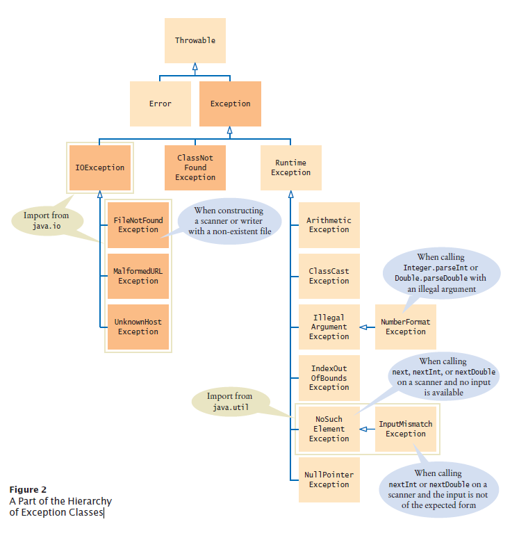

# Java OOP

## 7. POLYMORPHISM

### Intro
- a method can do different things and have many different forms of results depends on the object that it is acting on. (These objects share the same superclass.)
- Enables you to “program in the general ” rather than “program in the specific
- Polymorphism means that a variable of a supertype can refer to a subtype object. Example: Bird is a subtype of AnimalObject and AnimalObject is a supertype for Bird
- Key concept of polymorphism Relying on each object to know how to “do the right thing” in response to the same method call is.

### Powerful Technique

- Make the class design flexible and extensible with customized implementation.

  - i.e. new classes can be added with little modification, as long as the new classes are part of the inheritance hierarchy;
  - The only parts of a program that must be altered to accommodate new classes are those that require direct knowledge of the new classes that we add to the hierarchy.

- Method overriding allows a subclass to use all the general definitions from the superclass and add specialized definitions. i.e. enable code REUSE.
- Polymorphism is work with BOTH interface and inheritance.
  - Interfaces are particularly useful for assigning COMMON functionality to possibly UNRELATED classes
  - This allows objects of these classes to be processed polymorphically objects of classes that implement the same interface can respond to all of the interface method calls

### Tips to remember

- Polymorphism enables you to deal in generalities and let the execution time environments handle the specifics
- objects to behave in manners appropriate to those objects, without knowing their specific types as long as they belong to the same inheritance hierarchy.
- Polymorphism promotes extensibility
  - Software that invokes polymorphic behavior is independent of the object type to which the messages are sent.
  - Therefore, new object types that can respond to the existing method calls can be added into a system without changing the base system.
  - Only the client code that instantiates new objects must be changed to accommodate new types.
- A polymorphic reference is a variable that can refer to different types of objects at different points in time
- The method invoked through a polymorphic reference can change from one invocation to the next
- All object references in Java are potentially polymorphic

### Polymorphism Through Inheritance
- It is the type of the object being referenced, not the reference type, that determines which method is invoked. 
  - Mammal pet = new Mammmal() => pet refers to a Mammal object, it invokes the Mammal version of move
  - Mammal pet = new horse()=> pet refers to a Horse object, it invokes the Horse version of move

### Reference and Inheritance
An object reference can refer to an object of its class, or to an object of any class related to it by inheritance.
For example, Holiday class is the parent of Christmas , then a Holiday reference could be used
to point to a Christmas object. Holiday special = new Christmas(); Clock obj = new AlarmClock();

### Types of Polymorphism
- static (compile-time Polymorphism) method overloading
- dynamic (run-time Polymorphism) method overriding
  - call an overridden method is resolved at runtime.

### Method Overriding in Java
- child class choose to have its own implementation to existing methods in parent class
- The method in super class and subclass must have same  method signature (argument list: method name, same method arguments), and same method return. 
- For same method with different method arguments (number, type, order), it is method overloading.
- The method in the parent class =  “overridden”
- The method in the child class = “overriding”
- advantage:
  - child class choose to have a different implementation
  - child class choose to use parent class method
  - parent class code not need to be changed
- Rules for method overriding
  - Argument list of overriding method must match the overriden method
  - Access modifier of the overriding method cannot be more restrictive than the overriden method of parent class
  - private, static, and final method cannot be overriden as they are local to the class. 
  - static method can be re-declared in the subclass 


### binding
- Binding is the association of method call to the method body.
- dynamic/late binding:  
  - occurred at run time, then that line of code would call different method with same method name depends on the object.
- static/early binding: 
  - The binding of static, private and final methods is done at compile time. These method cannot be overridden and the type of the class is determined at the compile time.


### Method Matching versus Binding
- Matching a method signature and binding a method implementation are two issues.
- Method Matching
  - The compiler finds a matching method according to method signature (parameter type, number of parameters, and order of the parameters) at compilation time.
- Binding
  - A method may be implemented in several subclasses. The Java Virtual Machine (JVM) dynamically binds the implementation of the method at runtime

### polymorphism vs inheritance 

S.NO | Inheritance | Polymorphism
---|---|---
1 | Inheritance is one in which a new class is created (derived class) that inherits the features from the already existing class (Base class). | Whereas polymorphism is that which can be defined in multiple forms.
2 | It is basically applied to classes. | Whereas it is basically applied to functions or methods.
3 | Inheritance supports the concept of reusability and reduces code length in object-oriented programming. | Polymorphism allows the object to decide which form of the function to implement at compile-time (overloading) as well as run-time (overriding).
4 | Inheritance can be single, hybrid, multiple, hierarchical and multilevel inheritance. | Whereas it can be compiled-time polymorphism (overload) as well as run-time polymorphism (overriding).
5 | It is used in pattern designing. | While it is also used in pattern designing.
6 | Example: <br> The class bike can be inherit from the class of two-wheel vehicles, which is turn could be a subclass of vehicles. <br> | Example: <br> The class bike can have method name set_color(), which changes the bike’s color based on the name of color you have entered.
7 |  refers to using the structure and behavior of a super class in a subclass. | changing the behavior of a super class in the subclass. 
8 code reuse? | Polymorphism + code reuse | interfaces provide only polymorphism but no code reuse 
9 which parent's method to use | inherits all the things |select which method to use 
10 reserved word | extends | @Overriding 


## 8. INTERFACE

### intro of interface

- interface is a collection of abstract methods and constants
  - abstract methods no implementation (method body)
  - no need to add abstract keyword
  - All fields are implicitly public static and final .
- interface is used to establish a set of common methods classes will implement
- all methods in a interface needs to be implemented in classes implements it
  - no need to add public keyword 
x- all constants will be able to accessed by the classes implements it 
- a interface can implement another interface
- interfaceis a reserved word
- cannot be instantiated

### Class implements interfaces
  - A class can implement multiple interfaces
  - implements clause 
  - The class must implement all methods in all interfaces listed in the header
  - can access to all constants to the interfaces listed in the header
  - A class that does not implement all the methods of the interface is an abstract class and must be declared abstract

###  Why Interfaces?

- let unrelated classes implement a set of common methods and constants;
- define and standardize the ways in which things such as people and systems can interact with one another.

### some tips to remember

- In a concrete class that implements an interface, not implement any of the interface’s abstract methods result in a
compilation error indicating that the class must be declared abstract
- When declaring a method in an interface, choose a method name that describes the method’s purpose in a general manner, because the method may be implemented by many unrelated classes.
- All objects of a class that implements multiple interfaces have the is-a relationship with each implemented interface type.
- Including the default keyword in a private interface’s methods declaration is a compilation error because default methods
must be public.
- Just as superclasses can change, so can interfaces. If the signature of an interface method changes, all corresponding classes
would require modification. Interfaces change less frequently than implementations.

# Creating and Using Interfaces
- An interface is often used when unrelated classes need to share common methods and constants 
  - Allows objects of unrelated classes to be processed polymorphically by responding to the same metho calls.
  - You can create an interface that describes the desired functionality , then implement this interface in any classes that require that functionality.


### interface vs abstrace classes
- An interface should be used in place of an abstract class when there is no default implementation to inherit that is, no fields and no concrete method implementations.

No. | Interface | Abstract classes
---|---|---
Type of method |Abstract|Abstract, Non-abstract, Default, Static
Variable | Static, Final | Final, Non-final, Abstract, Non-abstract
Implementation | can’t provide the implementation of abstract class.| Abstract class can provide the implementation of interface.  
Keywords | implements | extends 
Multiple implementation | An interface can extend another Java interface only | an abstract class can extend another Java class and implement multiple Java interfaces.
Accessibility of Data Members | Members of a Java interface are public. | abstract class can have class members like private, protected, etc.

### UML 
- The UML distinguishes an interface from other classes by placing «interface» above the interface name.
- The UML expresses the relationship between a class and an interface through a realization .
  - A class diagram models a realization as a dashed arrow with a hollow arrowhead pointing from the implementing class to the interface .
- A subclass inherits its superclass’s realization relationships.

### interface
- You could write a class that implements certain methods (such as compareTo ) without formally implementing the interface (Comparable).
- However, formally establishing the relationship between a class and an interface allows Java to deal with an object in certain ways

### References and Interfaces
- Suppose we have an interface called Speaker, The interface name can now be used as the type of a reference variable: Speaker current; the variable current can now point to any object implements Speaker.

### Polymorphism via Interfaces
- depends on the type of object that is referencing to, there will be different version of the same name method declared in the interface 
- A key disadvantage of implementation inheritance is that the tight coupling among the classes can make it difficult to modify the hierarchy.

### Implementation Inheritance vs Interface Inheritance 
- Implementation Inheritance Is Best for Small Numbers of Tightly Coupled Classes 
  - Changes to a superclass directly affect all corresponding subclasses

- Interface Inheritance Is Best for Flexibility 
  - Interface inheritance often requires more work than implementation inheritance , because you must provide implementations of the interface’s abstract methods. …even if those implementations are similar or identical among classes.
  - Gives you additional flexibility by eliminating the tight coupling between classes.


## 9. EXCEOPTION HANDLING

### 9.1 intro 

what is exception?
- An Exception is an unwanted event that interrupts the normal flow of the program. 
- It is not a good programming practice to leave exceptions unhandled (i.e. the system THROW a exception and stop the program)
- Exception - indication of problem occurs during program's excution 

Why an exception occurs?
- ArithmeticException: divide a number by zero
- NullPointerException: When a variable contains null value and you are performing an operation on the variable.
- NumberFormatException: a type mismatch. Let’s say you are trying to perform an arithmetic operator on a string variable.
- ArrayIndexOutOfBoundsException: access the array index which is beyond the size of array

What and why exception handling?
- Exception handling allows us to handle the runtime errors caused by exceptions.
- These system generated messages are not user friendly so a user will not be able to understand what went wrong. In order to let them know the reason in simple language, we handle exceptions. We handle such exceptions and then prints a user friendly warning message to user, which lets them correct the error as most of the time exception occurs due to bad data provided by user.
- Exception handling ensures that the FLOW OF THE PROGRAM doesn’t break when an exception occurs.
- A program can continue executing (maintain normal flow rather than terminating ) after dealing with a problem.
  - Robust and fault tolerant programs (i.e., programs that can deal with problems as they arise and continue executing ).

When to Use Exception Handling
- Exception handling is designed to process SYNCHRONOUS errors, which occur when a statement executes .
  - e.g. out of range array indices, arithmetic overflow, division by zero, invalid method parameters
- Exception handling is NOT designed for Asynchronous events
  - e.g. disk I/O completions, network message arrivals, mouse clicks and keystrokes

Think it through
- Exception handling provides a single uniform technique for documenting , detecting and recovering from errors.
- Better to incorporate exception handling and error recovery strategy from the BEGINNING of your design process than at the end of implementation.

Exception Handling - Throwing Exceptions
1. detect an error
2. throw an exception object to signal an exceptional condition
3. method terminates immediately
4. execution continues with an exception handler  



Types of Exception
- user-defined exception
- built-in Exception
  - CHECKED exception 
    - The classes (IOException and ClassNotFoundException) which directly inherit Throwable class except RuntimeException.
    - external reason that the programmer cannot prevent (no matter how careful you are: disk error, broken network connection).
      - The compiler checks that your program handles these exceptions.
      - Program will NOT compile if no indication of how to handle checked exceptions.
  - UNCHECKED exception: 
    - programmer’s fault
    - not checked at compile time so compiler doesn't check whether progrmmer has handled them or not. 
    - The classes which inherit RuntimeException
      - ArithmeticException , 
      - IllegalArgumentException ,
      - NullPointerException , 
      - ArrayIndexOutOfBoundsException

Errors
- doesn’t occur due to bad data entered by user.
- indicates a system failure, disk crash or resource unavailability
- Error is irrecoverable: not in the scope of a programmer to handle. 
  - OutOfMemoryError, VirtualMachineError, AssertionError etc.

Difference between error and exception
- Errors 1. something went wrong which is not in the scope of a programmer to handle. 2. the error doesn’t occur due to bad data entered by user rather it indicates a system failure, disk crash or resource unavailability.
- Exceptions are events that occurs during runtime due to BAD DATA entered 

throws
- handle the checked exception in the same method that throws i to satisfy the compiler 
- tell the comiler you are aware of the exception
- you want the method to terminate if the exception occurs
- add a throws clause to the method header
- If some code within a method throws a checked exception, then the method must either handle the exception or it must specify the exception using the throws keyword in method signature.
  - public void readData(String filename) throws FileNotFoundException

Throws Clause 
- The throws clause signals to the caller of your method that it may encounter a IOException
- NOTE : Java provides exception facility such that: some methods can detect, some methods can handle, and other methods just pass them along.
- Throw early, catch late
- syntax: public void readData(String filename) throws FileNotFoundException
  - you may specify all checked exceptions that this method may throw
  - you may also liste unchecked exceptions

Catching Exceptions
- place the statements that can cause an exception in the try block and the handler inside a catch clause
- produce a printout of the chain of method calls that led to the exception by calling: exception.printStackTrace();
- 

Closing Resources
- try with resources
- trt(PrintWriter out = new PrintWriter(filename)) {
    writeData(out);
  } // out.close() is always called

try-with-resources: auto resource deallocation
- Typically resource release code should be placed in a finally block to ensure that a esource is released , regardless of whether there were exceptions when the resource was used in the corresponding try block.
- An alternative notation the try with resources statement simplifies writing code in which you
obtain one or more resources, use them in a try block and release them in a corresponding finally block.


### Frequently used terms in Exception handling 
- Try 
  - The code that can cause the exception
  - must followed by either Catch or Finally
  - cannot standalone
- Catch 
  - The code to handle exception if it occurs
  - must preceded by Try 
  - can be followed by Finally 
- Finallly
  - execute the important code even if some issue happen
  - Executed despite exception being handled or not.
- Throw
  - It is used to explicitly throw an exception. It can be used to throw a checked or unchecked exception.
  - throw a exception "show me ... do this ..."
- Throws
  - "throws" is a warning sign that tells other parts of the code that a method might cause an exception;
  - It is used in method signature. It indicates that this method might throw one of the declared exceptions. While calling such methods, we need to handle the exceptions using try-catch block.
  - exception declaration "the thing could go wrong in A, B, and C"
  - give you a log of all methods executed success or not: catch (IOException exception)  {exception.printStackTrace();}

Think it through
- Exceptions may surface through explicitly mentioned code in a try block, through deeply nested method calls initiated by code in a try block or from Java Virtual Machine as it executes Java bytecodes.

Multi-catch
- when to use? If the bodies of several catch blocks are identical
- syntax: catch (Type1 | Type2 | Type3 e)

Uncaught exception

multithreaded model 
- each thread is a concurrent activity
- one program can have many threads
- if a program has only one thread, an uncaught exception will cause the program to terminate 
- if a program has multiple threads, an uncaught exception will terminate only the thread in which the exception occurred.

termination model of exception handling.
- the try block terminate immediately if an exception occurs
- the program control transfers to the first matching catch block
- after the exception is handled, contol resumes after the last catch block 

throws...
- when a method throws an exception, the method teminates and does not return a value, and its local variable s go out of scope.
  -Garbage collection. if the local varialbles were reference s to object s and therer werere no other referenece s to those objects, the objects would be available for garbage collection.
- Think it through
  - if a subclass method overrides a superclass method, it is an error for the subclass method to list more exceptions in its throws clause than the superclass method does. A subclass's throws clause can contain a subset of a superclass's throws clause.

Java Exception Hierarchy
- If a catch handler is written to catch superclass exception objects, it can also catch all objects of that class’s subclasses.
- This enables catch to handle related exceptions polymorphically.
- you can catch each subclass individually if those exceptions require different processing.
- if multiple catch blocks match a particular exception type, only the first matching catch block executes.
- it is a  compilation error to catch the excat same type in two different catch bocks associated with a particular try block.

Finally block
- programs obtain certain resources must return them to the system to avoid so-called resource leaks.
  - in c and c++, most common resource leak is a memory leak. java automatically garbage collects memory no long used by programs, thus avoiding most memory leaks
  - Other types of resource leaks can occur in java
    - files, databbase connections and network onnections that are not colosed properly might not be available for use in other programs
- finally block will execute whether or not an exception is thrown in the try or catch block
  - if a catch throw a exception, execute finally block first, and then execute the catch block in superclass
- finally block will not execute if the application exits early form a try block by calling method System.exit
- Because a finally block always executes, it typically
contains resource release code.
  - if no exception occurs, finally block free the resource, adn go to the first statement after the finally block.
  - if an exception occurs, try block terminates. Process catch block, then finally block release the resource, and go to first statement after the finally block.
  - if doesn't catch the exception, finally block still release, and try catch the exception in a calling method.

Rethrow an Exception
- Done when a catch block, cannot process that exception or can only partially process it.
- Defers the exception handling (or perhaps a portion of it) to another catch block associated with an outer try tatement.
- Rethrow by using the throw keyword , followed by a reference to the exception object that was just caught.


## 10. COLLECTION 
### intro
- is a framework that provides an architecture to STORE and MANIPULATE a group of objects. 
- 5 keywords of collection: It can achieve all the operations that you perform on a data including SEARCHING, SORTING, INSERTION , MANIPULATION, and DELETION.

### Collections Framework
Most common collections 
- List: ordered
  - ArrayList
  - Stack: last in first out (like a stack of books); only add and remove at the top
  - LinkedList
- Set: unordered, unique
- Map 
  - Keeps associations between key and value objects
  - every key in the map has an associated value
  - the map stores the KEYS, VALUES, and the ASSOCIATIONS between them 
  - e.g., HashMap and TreeMap
- Queue:
  - first in first out (like a line of people waiting at SuzieQ)
  - a priority queue
    - unordered collection
    - efficient REMOVING the element with the highest priority


### Collection interface 
  - at the root
  - all collection classes implement this interface 
- List interface 
  - remember the order of its elements
  - two implementing classes: ArrayList, LinkedList
- Set interface 
  - unordered of unique elements
  - arranges its elements so that FINDING, ADDING, and REMOVING elements is more efficient 
  - two mechanisms to do this: hash tables, binary search trees

### A collections framework
- is an architecture for representing and manipulating collections. All collections frameworks contain:
- Interfaces
- implementation classes: data structures that can be reused 
- algorithms: methods for computations 

### Advantages
- API consistency: the API has a set of interfaces like Collection, Set, List, or Map
- reduce programming efforts: programmers can focus on use Collection instead of DESIGN Collection
- ENhances the speed and quality of programs: provides high-performance implementations of data structures and algorithms 

### Collection Methods
- every class implements Collection interface has these methods
- sort
- binarySearch
- reverse
- shuffle
- fill 
- copy 

### ArrayList 
---
```
// Create a new ArrayList with some elements
ArrayList<String> list = new ArrayList<>();
list.add("Apple");
list.add("Banana");
list.add("Cherry");

// Get an Iterator object for the list
Iterator<String> it = list.iterator();

// Iterate over the list and print each element
while (it.hasNext()) {
    String element = it.next();
    System.out.println(element);
}
```

- ArrayList vs LinkedList
  - Internal data structure: ArrayList stores its elements in a dynamically resizing array, while LinkedList stores its elements in a doubly linked list data structure.
  - In general, if you need fast random access to elements and do not need to frequently insert or delete elements in the middle of the list, ArrayList is a better choice. If you frequently insert or delete elements in the middle of the list and do not need fast random access, LinkedList may be a better choice.

### LinkedList
- used for collecting a sequence of objects
- A linked list consists of a number of nodes
  - Each node has a reference to the next node.
  - A node is an object that stores an element and references to the neighboring nodes.
- Adding and removing elements in the middle of a linked list is efficient.
- Visiting the elements of a linked list in sequential order is efficient.
- Random access is not efficient.
```
// Create a new LinkedList of strings
LinkedList<String> list = new LinkedList<>();

// Add some elements to the list
list.add("Apple");
list.add("Banana");
list.add("Cherry");

// Get the first element in the list
String first = list.getFirst();
System.out.println("First element: " + first);

// Get the last element in the list
String last = list.getLast();
System.out.println("Last element: " + last);

list.removeFirst();// Remove the first element from the list
list.removeLast();// Remove the last element from the list

// Print the remaining elements in the list
System.out.println("Remaining elements: ");
for (String element : list) {
  System.out.println(element);
}
```

### List Iterator
- Use a list iterator to ACCESS elements inside a LINKEDLIST.
- Encapsulates a position anywhere inside the linked list.
- Think of an iterator as pointing between two elements: Analogy: like the cursor in a word processor points between two characters
- To get a list iterator, use the listIterator method of the
LinkedList class.
- a generic type: a type that can be parameterized with one or more type parameters. For example, the ArrayList and ListIterator class in Java is a generic class
```
ArrayList<String> list = new ArrayList<String>();
```
- Initially points before the first element.
- The nodes of the LinkedList class store two links
  - To move the list position backwards, use: hasPrevious() and previous()
  - To move the list position forwards, use: hasNext() and next()
- The add() method adds an object after the iterator. Then moves the iterator position past the new element.
- remove()
  - remove the last element returned by next() or previous()
  - You cannot call it immediately after a call to add
  - can be called only once after calling next or previous
---
```
// create a LinkedList 
LinkedList<String> employeeNames = . . .;

// create a list iterator
ListIterator<String> it = employeeNames.listIterator;

if(it.hasNext()){
  it.next(); // Move the position with next method. next() returns the element that the iterator is passing. The return type of the next method matches the list iterator's type parameter.
}

// To traverse all elements in a linked list of strings:
while(it.hasNext()){
  String name = it.next();
  // Do something with name
  System.out.println(name);
}

// To use the “for each” loop:
for (String name : employeeNames){
  // Do something with name
    System.out.println(name);
}

// To remove all names that fulfill a certain condition:
while(it.hasNext()){
  String name = it.next();
  if (condition is fulfilled for name)
    it.remove();
}
```

---

### Sets
- You cannot add an element to a set at an iterator position. A set is unordered.
- You can remove an element at an iterator position.
- The iterator interface as no previous method.

### HashSet 
- A set organizes its values in an order that is optimized
for efficiency.
  - Inserting and removing elements is more efficient with a set than with a list.
  - A Set implementation arranges the elements so that it can locate them quickly.
- The Set interface has the same methods as the Collection interface.
- A set does not admit duplicates
- May not be the order in which you add elements.
- Two implementing classes: 
  - HashSet based on hash table
  - TreeSet based on binary search tree
- Elements in a hash table must implement the method hashCode
- Must have a properly defined equals method.
- You can form hash sets holding objects of type String ,
Integer , Double , Point , Rectangle , or Color
- in a hash table , objects with the same hash code are placed in the same group

- HashSet vs HashMap
  - type of data they store. HashSet stores a collection of unique elements, while HashMap stores key-value pairs. 

- Set vs List
  - Duplicates: A List allows duplicate elements, while a Set does not. 
  - Ordering: A List preserves the order of its elements, while a Set does not guarantee any specific order of its elements. However, some implementations of Set, such as LinkedHashSet, do maintain the insertion order of elements. 
  - Access and retrieval: A List allows elements to be accessed and retrieved by their index position, while a Set does not provide this capability. In a Set, elements are retrieved using their values.


### TreeSet
- sorted order, but still unordered
- elements stored in nodes
- The nodes are arranged in a tree shape
- You can form tree sets for any class that implements the
Comparable interface, like String or Integer. 

- TreeSet vs HashSet: Use a TreeSet if you want to visit the set's elements in sorted order.  Otherwise choose a HashSet


---

### Map
- Use a map when you want to look up objects by using a key
- associate a key SET with a value collection
  - Why is the collection of the values of a map not a set? Value may duplicate.
  - Why is the collection of the keys of a map a set and not a list? The ordering does not matter, and you cannot have duplicates.
- Use the put method to add an association
- You can change the value of an existing association by calling put again
- The get method returns the value associated with a key:
- To remove an association, call the remove method with the key
- Set vs Map
  - Set stores a collection of unique elements, while Map stores association between keys and values. 


### HashMap
- key-value pair
- need to define the data type of key and value
- no order, rely on the key and value to access a data
- you can put millions of variable and their value in a HashMap
- HashMap<String, Integer> hashMapObj = new HashMap<String, Integer>();
- hashMapObj.put(): add data to your hashMapObj

```
// Create a new HashMap with String keys and Integer values
HashMap<String, Integer> map = new HashMap<>();

// Add some key-value pairs to the map
map.put("Alice", 25);
map.put("Bob", 30);
map.put("Charlie", 35);

// Get the value associated with a key
int age = map.get("Bob");
System.out.println("Bob's age is " + age);

// Check if a key is present in the map
boolean hasAlice = map.containsKey("Alice");
System.out.println("The map has Alice: " + hasAlice);

// Iterate over the key-value pairs in the map
for (String key : map.keySet()) {
    int value = map.get(key);
    System.out.println(key + " is " + value + " years old");
}
```

### Queue
- add to the tail, remove from the head: FIFO
- peek method to get the head element of the queue without
removing it.
- The LinkedList class implements the Queue interface.
- When you need a queue, initialize a Queue variable with a LinkedList object:
```
Queue<String> q =  new LinkedList<>();
q.add("A"); q.add("B"); q.add("C");
while (q.size() > 0) { System.out.print(q.remove() + " "); } // Prints A B C
```

### Priority Queue
- A priority queue collects elements , each of which has a priority.
  - Example: a collection of work requests, some of which may be more urgent than others.
- Does not maintain a FIFO discipline.
- Elements are retrieved according to their priority.
- Priority 1 denotes the most urgent priority.
- When you retrieve an item from a priority queue, you always get the most urgent one.

#### TIT 
- Why would you want to declare a variable as below instead of simply declaring it as a linked list? Answer: This way, we can ensure that only queue operations can be invoked on the q object.
```
Queue<String> q = new LinkedList<>();
```
- Why wouldn't you want to use an array list for implementing a queue? Answer: Depending on whether you consider the 0 position the head or the tail of the queue, you would either add or remove elements at that position. Both are inefficient operations because all other elements need to be moved.


### Stack

When you need a queue, initialize a Queue variable with a
LinkedList object:

### Choosing a Collection
- Determine how you access the values.
- Determine the element types or key/value types.
- Determine whether element or key order matters.
- For a collection, determine which operations must be
efficient.
- For hash sets and maps , decide whether you need to
implement the hashCode and methods
- equals
- If you use a tree, decide whether to supply a comparator.

